# Báo cáo Day 6: LiDAR-camera projection QA, đo độ nhạy với calibration drift

- **Họ tên:** Nguyễn Thanh Hòa
- **MSSV:** 2A202602559
- **Lớp:** AI20K-2A202602559
- **Link repo:** https://github.com/Jikay-070203/NguyenThanhHoa-2A202602559-Track4-Day21
- **Topic:** A — Kiểm tra calibration LiDAR-camera bằng projection 
- **Dataset:** data/kitti_mini, data/nuscenes_mini_subset, data/synthetic (chỉ để kiểm tra tay CP2)
- **Các frame đã dùng:** sweep trên kitti: 20 frame (000001 … 000061); nuscenes: 80 frame (scene-0103_000 … scene-1094_039); demo overlay: 000019, 000011, 000004, 000000, scene-0103_010, scene-1094_010

## 1. Claim

Trên KITTI mini, calibration lệch yaw 1° làm hit rate (điểm LiDAR của object còn rơi trong 2D box của nó) giảm từ 99.2% xuống 92.4%; vật xa (>30 m) tụt 29.9 điểm % (99.5% → 69.6%, n=1278 điểm) so với 2.8 điểm % ở vật gần (<15 m). Alignment contrast (biên độ sâu LiDAR so với cạnh ảnh) báo động đúng ≥ 90% với cửa sổ 5 frame ở false-alarm 5% từ yaw ≥ 1.5°; trên nuScenes (LiDAR 32 beam) chỉ số KHÔNG đạt 90% ở bất kỳ mức nào đến 3°.

(Hit rate = % điểm LiDAR nằm trong box 3D ground-truth của object, nhìn thấy trong ảnh khi calibration đúng, mà sau khi lệch vẫn rơi vào 2D box của object đó. Điều kiện kiểm chứng: lệch trong LiDAR frame, mỗi lần một trục, gộp hai chiều ±; false-alarm đặt ở 5%.)

## 2. Evidence

**Kiểm tra tay CP2** (`results/cp2_sanity.csv`): cả 4 kiểm tra PASS, gồm điểm (10,0,0) cho z_cam ≈ 9,73 và pixel ≈ (614,175), điểm sau xe bị loại, NaN/Inf không làm crash. Tính lặp lại: PASS: chạy lại `exp_sweep --quick` 2 lần cho cùng checksum (sha256 0d19bbeae44e / 0d19bbeae44e).

**Ảnh overlay ở 3 khoảng cách** (`results/demo_overlay_stats.csv`): gần (<6 m), trung bình, xa (>50 m), màu theo depth (đỏ gần, xanh xa), khung xanh là 2D box của label.

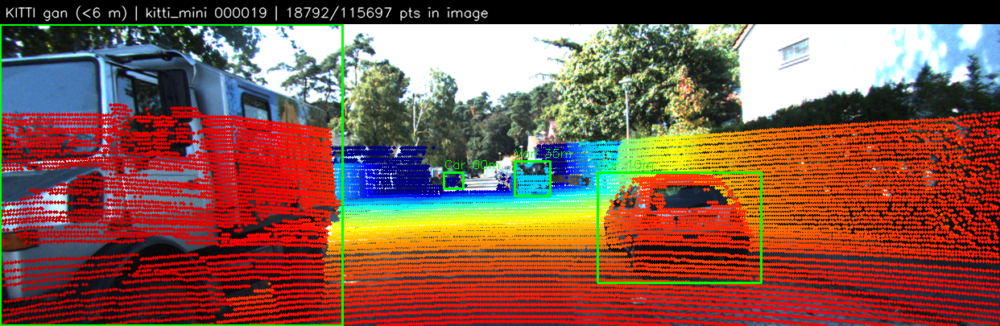
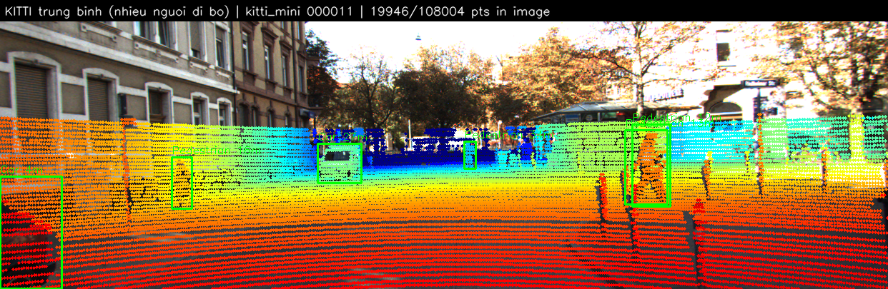
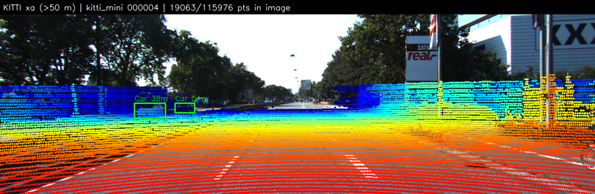

**Ảnh lệch** (cùng frame, yaw 0°/1°/2°/3°): `results/figures/drift_gallery_kitti_000011.png`

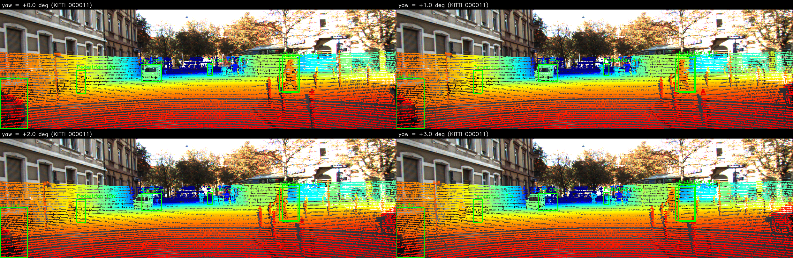

**kitti - quét yaw** (`results/calib_sweep_summary.csv`, `results/alignment_detection.csv`)

| yaw | % điểm trong ảnh | hit rate % | hit 0-15m % | hit 15-30m % | hit 30-50m % | hit >50m % | precision % | contrast | TPR 1 frame | TPR 5 frame |
|---|---|---|---|---|---|---|---|---|---|---|
| 0° | 15.74 | 99.2 | 99.6 | 98.3 | 99.6 | 99.0 | 47.9 | 0.112 | – | – |
| 0.25° | 15.74 | 98.7 | 99.5 | 97.6 | 97.4 | 93.5 | 47.7 | 0.104 | 0.05 | 0.11 |
| 0.5° | 15.74 | 97.3 | 99.1 | 95.3 | 90.7 | 83.5 | 47.0 | 0.087 | 0.25 | 0.40 |
| 1° | 15.74 | 92.4 | 96.8 | 87.9 | 72.8 | 59.3 | 44.7 | 0.066 | 0.40 | 0.79 |
| 1.5° | 15.74 | 86.7 | 93.3 | 79.9 | 56.8 | 34.8 | 41.9 | 0.049 | 0.57 | 0.93 |
| 2° | 15.74 | 81.3 | 89.4 | 73.2 | 45.0 | 14.1 | 39.2 | 0.036 | 0.70 | 0.98 |
| 3° | 15.74 | 71.4 | 81.5 | 60.9 | 24.5 | 0.0 | 34.3 | 0.024 | 0.72 | 1.00 |
**nuscenes - quét yaw** (`results/calib_sweep_summary.csv`, `results/alignment_detection.csv`)

| yaw | % điểm trong ảnh | hit rate % | hit 0-15m % | hit 15-30m % | hit 30-50m % | hit >50m % | precision % | contrast | TPR 1 frame | TPR 5 frame |
|---|---|---|---|---|---|---|---|---|---|---|
| 0° | 8.73 | 99.5 | 99.2 | 99.9 | 100.0 | – | 44.5 | 0.040 | – | – |
| 0.25° | 8.73 | 99.2 | 98.9 | 99.6 | 99.8 | – | 44.5 | 0.036 | 0.07 | 0.10 |
| 0.5° | 8.73 | 98.7 | 98.6 | 98.9 | 98.3 | – | 44.3 | 0.030 | 0.11 | 0.17 |
| 1° | 8.73 | 96.3 | 97.1 | 95.6 | 91.0 | – | 43.5 | 0.019 | 0.19 | 0.37 |
| 1.5° | 8.72 | 92.7 | 94.5 | 91.0 | 81.0 | – | 42.1 | 0.013 | 0.24 | 0.50 |
| 2° | 8.73 | 88.3 | 90.9 | 85.7 | 70.0 | – | 40.2 | 0.009 | 0.21 | 0.60 |
| 3° | 8.72 | 78.3 | 83.1 | 73.7 | 47.3 | – | 36.0 | 0.002 | 0.24 | 0.77 |

Hit rate theo từng trục (rotation, độ) và (translation, cm) cho cả hai dataset:

| mức lệch | kitti roll | kitti pitch | kitti yaw | nuscenes roll | nuscenes pitch | nuscenes yaw |
|---|---|---|---|---|---|---|
| 0° | 99.2 | 99.2 | 99.2 | 99.5 | 99.5 | 99.5 |
| 0.25° | 99.3 | 98.7 | 98.7 | 99.5 | 99.5 | 99.2 |
| 0.5° | 99.2 | 97.1 | 97.3 | 99.2 | 99.4 | 98.7 |
| 1° | 98.7 | 92.1 | 92.4 | 95.7 | 99.3 | 96.3 |
| 1.5° | 97.8 | 86.1 | 86.7 | 90.2 | 99.1 | 92.7 |
| 2° | 97.0 | 79.4 | 81.3 | 85.0 | 98.5 | 88.3 |
| 3° | 94.9 | 64.8 | 71.4 | 69.5 | 96.0 | 78.3 |

| mức lệch | kitti tx | kitti ty | kitti tz | nuscenes tx | nuscenes ty | nuscenes tz |
|---|---|---|---|---|---|---|
| 0 cm | 99.2 | 99.2 | 99.2 | 99.5 | 99.5 | 99.5 |
| 2 cm | 99.2 | 99.2 | 99.3 | 99.4 | 99.4 | 99.5 |
| 5 cm | 99.2 | 99.1 | 99.0 | 99.3 | 99.4 | 99.5 |
| 10 cm | 99.1 | 98.6 | 97.8 | 99.1 | 99.3 | 99.2 |
| 20 cm | 99.0 | 96.5 | 95.2 | 97.8 | 99.1 | 97.6 |

Về khoảng cách: ở KITTI yaw 1°, đúng như kỳ vọng hình học, vật xa nhạy hơn vật gần (gần 99.6% → 96.8%, xa 99.5% → 69.6%). Hit rate theo dải khoảng cách và theo từng trục:

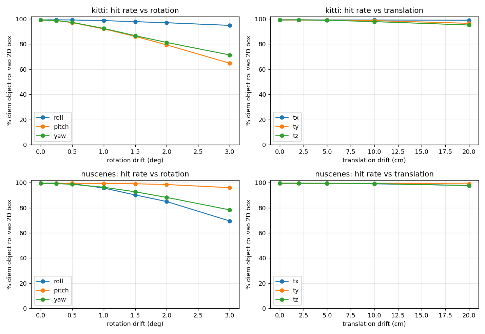
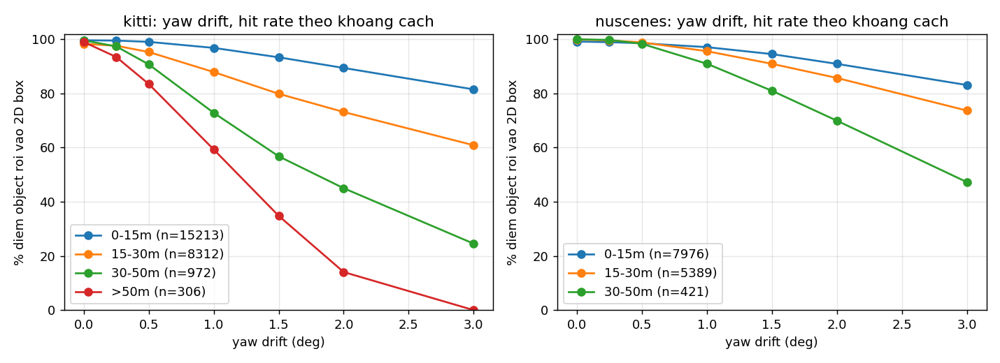

**Alignment score và ngưỡng phát hiện** (Advanced). Điểm số = trung bình exp(−d/σ) tại các điểm LiDAR "biên độ sâu", d là khoảng cách tới cạnh Canny gần nhất; `contrast` = điểm số trừ điểm số của chính các điểm đó khi dịch ảnh ±3° (loại ảnh hưởng của việc cảnh nhiều/ít cạnh). Ngưỡng τ = phân vị 5% của frame khỏe (`tau_single` trong `results/alignment_detection.csv`); cột "TPR 5 frame" gộp 5 frame liên tiếp.

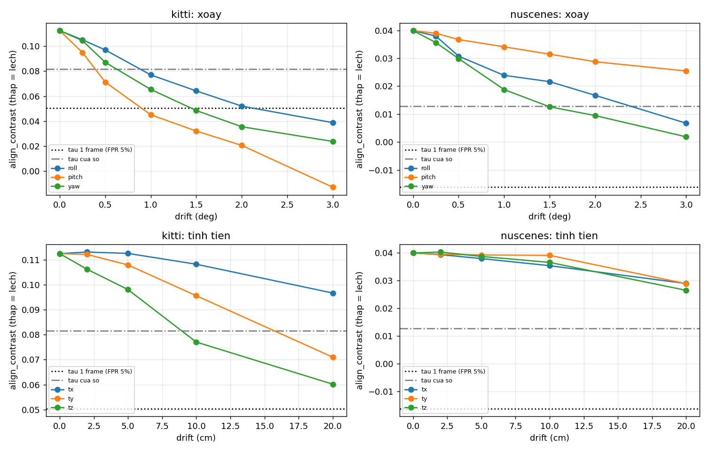
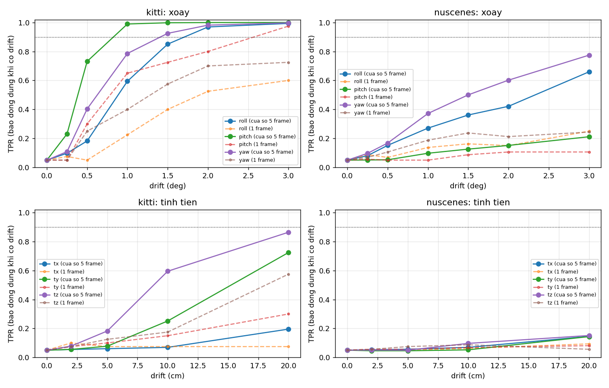

**So sánh hai dataset (B5)** (`results/calib_sweep_summary.csv`):

| dataset | số frame | số điểm object | % điểm trong ảnh | hit rate gốc % | tụt @ yaw 1° (điểm %) | tụt @ yaw 3° | tụt @ tx 10 cm | contrast gốc | AUC @ yaw 1° |
|---|---|---|---|---|---|---|---|---|---|
| kitti | 20 | 24803 | 15.74 | 99.2 | 6.7 | 27.8 | 0.0 | 0.112 | 0.77 |
| nuscenes | 80 | 13786 | 8.73 | 99.5 | 3.2 | 21.2 | 0.4 | 0.040 | 0.66 |

Giải thích khác biệt KITTI/nuScenes (B5): chỉ 8.7% điểm nuScenes rơi vào ảnh so với 15.7% của KITTI và LiDAR 32 beam thưa hơn nên mỗi object có ít điểm hơn, biên độ sâu khó đo (xem cột AUC và `align_nan_frac`); ảnh nuScenes 1600×900 với tiêu cự lớn hơn nên cùng một góc lệch cho số pixel lệch lớn hơn (`results/analytic_shift.csv`) nhưng box 2D của nuScenes được suy ra từ chính box 3D (không phải nhãn 2D độc lập như KITTI) nên hit rate gốc gần 100% và thang so sánh khác nhau; cảnh đêm sau mưa của scene-1094 làm Canny ít cạnh tin cậy hơn.

**Latency (B3)** (`results/latency_projection.csv`), mỗi giai đoạn bỏ warm-up rồi đo 30 lần, phần cứng: Intel(R) Xeon(R) CPU @ 2.20GHz, 4 nhân, Linux-6.18.48+-x86_64-with-glibc2.39, Python 3.13.15, numpy 2.1.3, OpenCV 4.14.0; chỉ chạy CPU.

| dataset | giai đoạn | số điểm | p50 (ms) | p95 (ms) | số lần đo | warm-up bỏ |
|---|---|---|---|---|---|---|
| kitti | project (velo_to_cam + cam_to_image) | 108,004 | 22.4 | 25.9 | 30 | 3 |
| kitti | overlay (ve diem len anh) | 108,004 | 102.3 | 119.3 | 30 | 3 |
| kitti | alignment score (bien do sau + so canh) | 108,004 | 6.4 | 7.9 | 30 | 3 |
| kitti | full check (project + hit/precision + alignment) | 108,004 | 36.9 | 44.7 | 30 | 3 |
| nuscenes | project (velo_to_cam + cam_to_image) | 34,720 | 4.8 | 6.5 | 30 | 3 |
| nuscenes | overlay (ve diem len anh) | 34,720 | 16.6 | 23.1 | 30 | 3 |
| nuscenes | alignment score (bien do sau + so canh) | 34,720 | 5.9 | 8.6 | 30 | 3 |
| nuscenes | full check (project + hit/precision + alignment) | 34,720 | 15.8 | 18.9 | 30 | 3 |

## 3. Failure case

Ba failure case được chọn tự động theo số đo (`src/exp_failure.py`, tóm tắt ở `results/failure_cases.csv`), thuộc ba lớp debug khác nhau.

### 3.1 Geometry: yaw 1° làm người đi bộ/vật xa mất điểm (`fail_01_yaw_1deg_pedestrian_000011.png`)

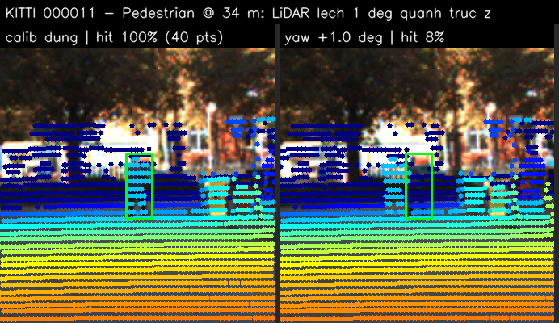

Frame KITTI `000011`, Pedestrian cách 34.1 m: hit rate **100.0% → 7.5%** khi LiDAR lệch yaw 1° (yaw 1 deg, 40 diem LiDAR cua object). Cơ chế: lệch góc θ làm điểm ở khoảng cách d dịch ngang d·tanθ = 0.60 m, so với bề rộng người đi bộ khoảng 0,6 m (`results/analytic_shift.csv`). Dịch trên ảnh là f·tanθ pixel (không đổi theo d) nhưng 2D box của vật xa chỉ rộng vài chục pixel nên dịch này đủ đẩy điểm ra ngoài box. **Lớp debug: Geometry** (extrinsic Tr_velo_to_cam). Cách phát hiện khi chạy thật: theo dõi hit rate/precision trên các object đã có box 2D từ camera detector và cảnh báo khi tụt kéo dài; vật xa và mảnh (người, cột) là "chim hoàng yến" báo lệch sớm nhất.
### 3.2 Time: bỏ bù ego-motion trên nuScenes (`fail_02_time_sync_noego_scene-0103_001.png`)

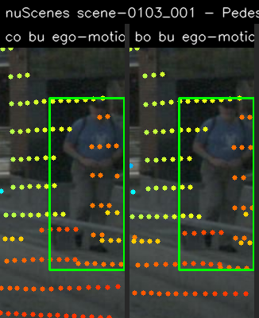

Calibration giữ nguyên, chỉ thay `use_ego_motion=False` (coi LiDAR và camera chụp cùng lúc). Frame `scene-0103_001`: dt LiDAR-camera -35.6 ms, shift median 9.3 px, p95 36.1 px; hit rate của Pedestrian @ 12.1 m **100.0% → 85.7%**. Trên toàn bộ 80 frame nuScenes: độ lệch thời gian LiDAR-camera trung vị -35.5 ms (min -39.5, max -34.2), pixel lệch trung vị 9.2 px (p95 cao nhất 58.8 px), hit rate tụt trung bình 1.0 điểm % (tối đa 14.3). Nguyên nhân: LiDAR quay 360° và camera chụp ở hai thời điểm khác nhau, xe (và vật) đã dịch chuyển trong khoảng đó; nếu không đi qua global frame bằng ego pose thì overlay lệch dù extrinsic hoàn toàn đúng. **Lớp debug: Time.** Cách phát hiện: ghi log |t_cam − t_lidar| từng frame và tốc độ xe, cảnh báo khi dt·v vượt ngưỡng pixel cho phép; KITTI không có timestamp trong bộ đề nên không kiểm được lớp này.
### 3.3 Metric: alignment score không thấy drift (`fail_03_alignment_blind_nuscenes_scene-0103_006_roll3deg.png`)

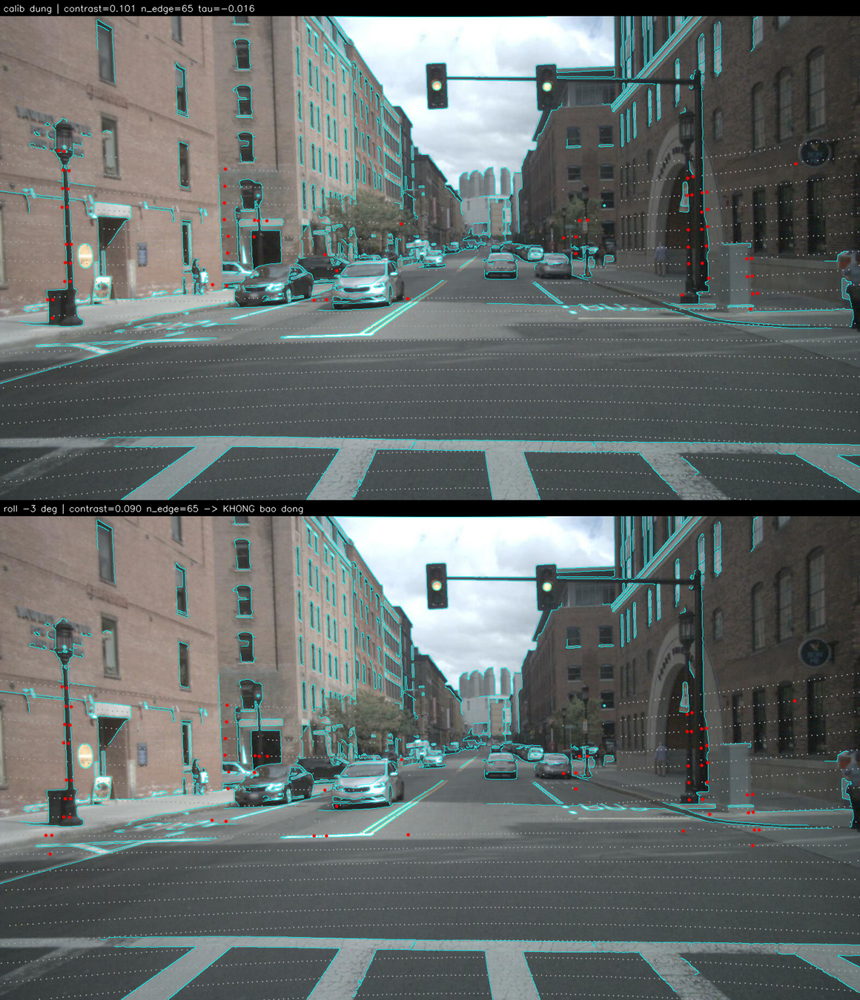

nuscenes `scene-0103_006`: hit rate thực tế **100.0% → 0.0%** nhưng alignment contrast gần như không đổi (drift that nhung alignment score khong bao dong; roll -3 deg, contrast 0.101 -> 0.090, tau -0.016, n_edge 65). Đây là điểm mù của chỉ số: khi các điểm biên độ sâu nằm trên cạnh dài song song hướng dịch, hoặc quá ít, hoặc ảnh ít cạnh (đêm, trời mù), khoảng cách tới cạnh ảnh không thay đổi nhiều dù calibration đã sai. Với frame này, nguyên nhân khả dĩ nhất: ít điểm LiDAR biên độ sâu để đo (đối chiếu ảnh: cạnh Canny màu cyan, điểm biên độ sâu màu đỏ). **Lớp debug: Metric** (chỉ số không phản ánh đúng mục đích). Cách giảm rủi ro: gộp nhiều frame (cửa sổ 5 frame), kết hợp thêm chỉ số theo object (hit rate) và chỉ tin chỉ số khi n_edge đủ lớn.

## 4. Khuyến nghị nếu triển khai thật

**Use-case: ADAS / xe tự hành có LiDAR + camera.** Chạy kiểm tra calibration như một health-check nền, không nằm trong vòng điều khiển: bước đầy đủ (chiếu + hit rate + alignment) mất kitti p50 37 ms / p95 45 ms; nuscenes p50 16 ms / p95 19 ms trên CPU, nên chạy 1 Hz hoặc trên một frame mỗi giây là đủ. Đánh đổi: hit rate cần box 2D từ detector camera (đắt, nhưng đã có sẵn trong pipeline); alignment score rẻ và không cần nhãn nhưng yếu trên LiDAR thưa/ảnh đêm. Vì vậy dùng hit rate theo object xa/mảnh làm chỉ số chính, alignment score làm chỉ số phụ, và quyết định theo cửa sổ vài chục frame thay vì 1 frame để giữ false-alarm thấp. Với drift ≥ 1° trở lên nên chuyển hệ thống sang chế độ giảm cấp (giảm tin cậy fusion, ưu tiên cảm biến còn lại) thay vì tin fusion LiDAR-camera.

**Chỉ số cần ghi log khi chạy thật:** hit rate và precision theo dải khoảng cách (0–15/15–30/30–50/>50 m); % điểm LiDAR trong ảnh; alignment contrast và `n_edge` (để biết khi nào chỉ số không đáng tin); |t_cam − t_lidar| và tốc độ ego từng frame; số object hợp lệ; nhiệt độ/va chạm (IMU) làm cờ kích hoạt kiểm tra lại. **Bước tiếp theo:** thêm dò cục bộ quanh calibration hiện tại (tìm yaw/pitch làm score tăng) để vừa phát hiện vừa ước lượng chiều lệch; dùng ring index của LiDAR thay vì cửa sổ ảnh để tìm biên độ sâu trên LiDAR thưa; và kiểm lại trên chuỗi liên tục có timestamp thật.

## 5. Cách chạy lại

Từ repo sạch, chỉ cần CPU (đã chạy trên Kaggle). Kết quả xác định (không có phần ngẫu nhiên; bootstrap dùng seed 0).

```bash
pip install -r requirements.txt
python tools/verify_data.py --data-root data/kitti_mini
python tools/verify_data.py --data-root data/nuscenes_mini_subset
python -m src.run_all --class-name "AI20K-2A202602559"        # chạy tất cả: demo, sweep, detect, failure, latency, check tái lập, sinh REPORT.md
# hoặc từng bước:
python -m src.exp_demo
python -m src.exp_sweep
python -m src.exp_detect
python -m src.exp_failure
python -m src.exp_latency
python -m src.make_report --class-name "AI20K-2A202602559"
python tools/check_submission.py
```

Công cụ dùng lại được (B4): mỗi script trong `src/` có `--help`; `python -m src.exp_sweep --datasets kitti --max-frames 5` cho phép kiểm tra nhanh calibration của một bộ dữ liệu mới theo cùng định dạng KITTI. Hướng dẫn chi tiết: `src/README.md`.

## 6. Khai báo sử dụng AI

| Công cụ | Dùng cho việc gì | Bạn đã kiểm chứng thế nào |
|---|---|---|
| Claude Code (Claude Sonnet 5.5) | Viết 2 hàm `TODO(CP2)` trong `starter/projection.py`; viết toàn bộ code trong `src/` (đo hit rate/precision/FOV, alignment score, sweep, phát hiện drift, failure case, latency) và `src/make_report.py` sinh báo cáo từ CSV | Kiểm tra tay CP2 tự động (`results/cp2_sanity.csv`: điểm (10,0,0) → z≈9,73, pixel≈(614,175), NaN/Inf, điểm sau xe); xem trực tiếp ảnh overlay `results/figures/demo_*.png` khớp xe/người/cột và không có điểm trên bầu trời; chạy lại sweep hai lần so sánh checksum (`results/determinism_check.txt`); mọi con số trong báo cáo được sinh từ CSV chứ không gõ tay |
